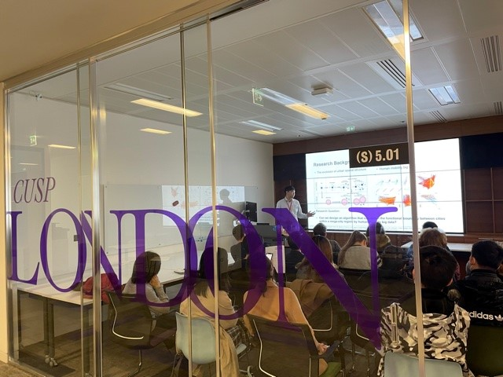

# Upcoming Events

**12th October 2022: CUSP London Women In Science Seminar Series: Professor Janet Pierrehumbert - The strong and weak suits of state-of-the-art NLP**  
14:00 - 16:00 BST [Eventbrite](https://www.kcl.ac.uk/events/wis-seminar-series-the-strong-and-weak-suits-of-state-of-the-art-nlp)

**13th October 2022**: CUSP London Seminar - Paul Dawson Mayors Office for Policing and Crime (MOPAC)  
**Title:** Telling Stories with Data – Reflections from City Hall  
**Abstract**: 
In the lecture, Paul will introduce the work of his team (MOPAC Evidence and Insight) and drawing upon a range of analytic case studies he will illustrate the interface between data analysis and policy making – and how these can work together to make London safer. 

**26th October 2022: CUSP London PhD Conference  12:30-17:30 King's College London - Bush House Central Block**

This is a wonderful opportunity to see if a PhD is something you would like to embark on and find out the best way to do this. 
* We have PhDs from 6 universities: King’s, Warwick, UCL, Newcastle, Glasgow and LSHTM presenting their work for 10 minutes each plus Q&A 
* Each PhD is at a different stage of their studies, so it will be a great insight into what each part of the process involves. 
* We will have refreshments and networking opportunities  
* All the presentations are varied to ensure an excellent overview. 

**If you would like to attend, please email me at CUSP-London@kcl.ac.uk by 18th October 2022.**
                                     

## More Information

<table border="0" cellspacing="0" cellpadding="0">
  <tr>
    <th>

<a href="https://twitter.com/cusplondon?lang=en">Follow us on Twitter</a>
    </th>
        <th>

<a href="https://www.linkedin.com/company/centre-for-urban-science-and-progress-london-cusp-london-king-s-college-london/)">Follow us on LinkedIn</a>
       </th>
   </tr>
</table>
  
[Contact us here.](./YouCanJoinUs.md)  

