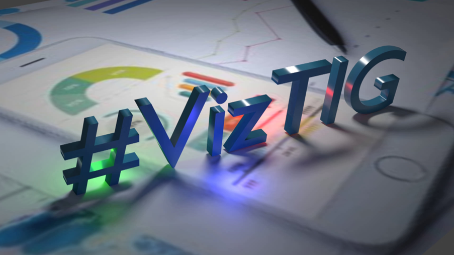

# Upcoming Events

Our next event is The Turing Visualization Group Symposium hosted by CUSP London and the Turing Network Development Award - at King's College London.
This event is over 2 days: 

Please Register on [Eventbrite](https://www.eventbrite.co.uk/e/viztig-symposium-2022-tickets-396511164567)

<b>Tuesday 13th September 2022, 15:00-17:00 BST</b> - Both on Campus at Bush House, or online.
Keynote presentation: Visualization from Digital Humanities Perspective
Introduced by Professor Stuart Dunn, Head of Digital Humanities, King's College London

What Data Visualization Reveals: Elizabeth Palmer Peabody and the Work of Knowledge Production, Professor Lauren F. Klein, Emory University 
Q&A and Refreshments

<b>Wednesday 14th September 2022, 12:00-17:00 BST</b> Lunch and networking followed by:

Keynote presentation: Visualization from a Science and Engineering Persepective
Introduced by Professor Nicolas Holliman - Director of CUSP London

The Landscape of Visualization: Future Challenges, Professor Min Chen, University of Oxford 
Q&A and Refreshment break

Panel Session - "Priorities for Visualization Research in AI and Data Science" 
Chaired by Professor Oliver Davis, Bristol University UK  
Professor Klaus Meuller, NY Stonybrook, Dr Alma Cantu, Newcastle University, Dr Maria-Cruz Villa-Uriol, Sheffield University
Professor Cagatay Turkay, Warwick University UK 
Q&A and Refreshments

***
| Date | Event |
|-----------------------|------------|
|6th October 2022|CUSP London Seminar Series begins -Tom Calver- Data Projects Editor at the Times and The Sunday Times|

***
| Date | Event |
|-----------------------|------------|
|26th October 2022|CUSP London PhD Conference 12:30 - 17:30 BST                                                         |

***
| Date | Event |
|-----------------------|------------|
|20th- 23rd February 2023|CUSP London Data Dive Event - Details To be Confirmed                                         |

## More Information
[Contact us here.](./YouCanJoinUs.md) 

[Follow us on Twitter](https://twitter.com/cusplondon?lang=en)
 

