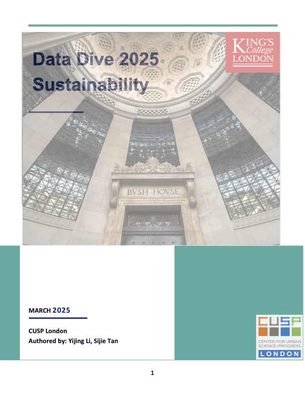
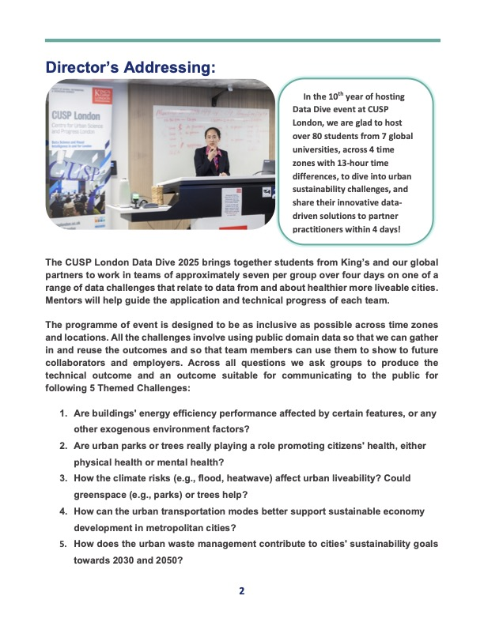
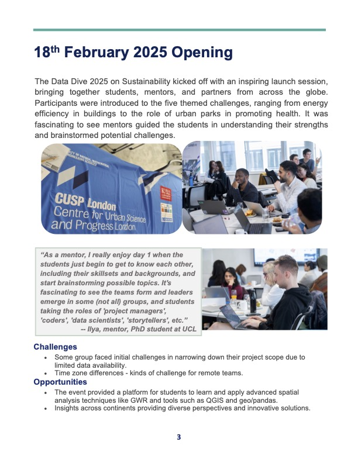
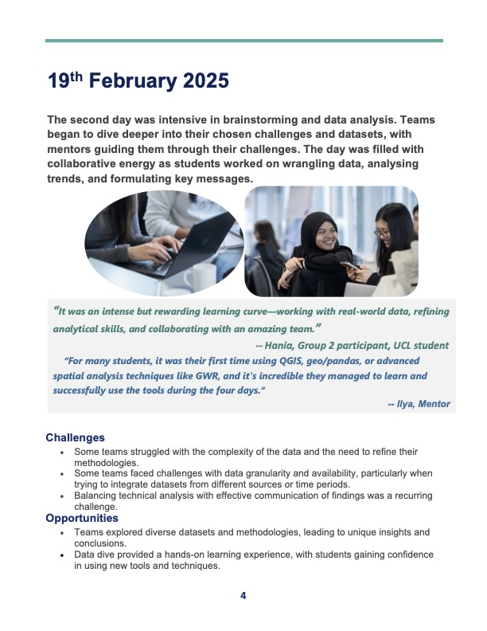

# Upcoming Events

  

-------------------------------- 

| Date        | Event    | Title      | Watch recording here |
| ------------- | ---------- | ---------- | ---------- |                             
18-21st Feb 2025|CUSP London Data Dive| Invitation Only - Please contact us to join||

Please contact us if you wish to come along to any of the above seminars CUSP-London@kcl.ac.uk.

The CUSP London Data-Dive-2025 brings together global student teams to address urban data challenges, to consider relationships between urban data variables in the domains of **Sustainability**, in cities such as: London, Glasgow, Warwick, New York & Peking, under the partnerships with [The Crown Estate](https://www.thecrownestate.co.uk/) and [Geolytix](https://geolytix.com/). The successful event report could be found at 

  
   
  

(./assets/dd_r5.jpg)(./assets/dd_r6.jpg)(./assets/dd_r7.jpg)(./assets/dd_r8.jpg)(./assets/dd_r9.jpg)(./assets/dd_r10.jpg)

- Are buildings' energy efficiency performance affected by certain features, or any other exogenous environment factors?

- Are urban parks or trees really playing a role promoting citizens' health, either physical health or mental health?

- How the climate risks affect urban livability? Could greenspace or trees help out?

- How the urban transportation modes can better support sustainable economy development in metropolitan cities?

- How the urban waste management contribute to cities' sustainability goals towards 2030 and 2050?

**Please [contact us to join](CUSP-London@kcl.ac.uk)**

## More Information

<table border="0" cellspacing="0" cellpadding="0">
  <tr>
    <th>

<a href="https://twitter.com/cusplondon?lang=en">Follow us on Twitter</a>
    </th>
        <th>

<a href="https://www.linkedin.com/company/centre-for-urban-science-and-progress-london-cusp-london-king-s-college-london/)">Follow us on LinkedIn</a>
       </th>
   </tr>
</table>
  
[Contact us here.](./YouCanJoinUs.md)  

