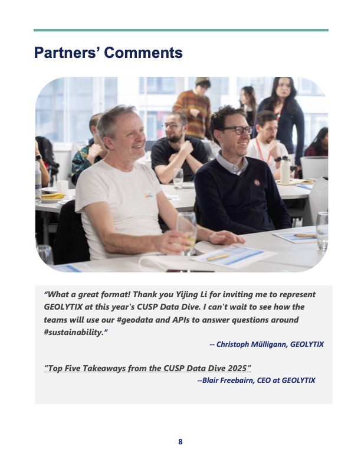

# Upcoming Events

  

-------------------------------- 

| Date        | Event    | Title      | Watch recording here |
| ------------- | ---------- | ---------- | ---------- |                             
18-21st Feb 2025|CUSP London Data Dive| Invitation Only - Please contact us to join||

Please contact us if you wish to come along to any of the above seminars CUSP-London@kcl.ac.uk.

The CUSP London Data-Dive-2025 brings together global student teams to address urban data challenges, to consider relationships between urban data variables in the domains of **Sustainability**, in cities such as: London, Glasgow, Warwick, New York & Peking, under the partnerships with [The Crown Estate](https://www.thecrownestate.co.uk/) and [Geolytix](https://geolytix.com/). The successful event report could be found at 

  
   
  
  
   
  
  
   
  

- Are buildings' energy efficiency performance affected by certain features, or any other exogenous environment factors?

- Are urban parks or trees really playing a role promoting citizens' health, either physical health or mental health?

- How the climate risks affect urban livability? Could greenspace or trees help out?

- How the urban transportation modes can better support sustainable economy development in metropolitan cities?

- How the urban waste management contribute to cities' sustainability goals towards 2030 and 2050?

**Selected testimonials:**
>> *"Participating in CUSP’s Data Dive was an intense yet incredibly rewarding experience. I had the opportunity to work on real-world sustainability data analysis, and the collaborative environment challenged me to think critically and solve problems under pressure. Even if I hadn’t received an award, I would still consider this a highly valuable experience. As a first-year student, this event gave me firsthand insight into how a data dive operates. The challenge not only strengthened my technical skills in Python but also deepened my understanding of how data science can contribute to sustainability solutions. I’d highly recommend this experience to anyone looking to develop practical data skills while working on impactful projects!" -- JM from King's College London*
>> *"I would like to thank CUSP London & NYU for giving us this rare opportunity(Data Dive 2025). I am also honored to receive the Best Technical Team Award. This event not only allowed me to learn a lot of new knowledge, but also allowed me to work with outstanding talents from different backgrounds in the school to explore innovative solutions for sustainable development. I would like to thank everyone in the organizing team for their hard work. In my opinion, this competition was great, and I look forward to more cooperation and exchanges in the future!" --LS from NYU New York*

**Please [contact us to join](CUSP-London@kcl.ac.uk)**

## More Information

<table border="0" cellspacing="0" cellpadding="0">
  <tr>
    <th>

<a href="https://twitter.com/cusplondon?lang=en">Follow us on Twitter</a>
    </th>
        <th>

<a href="https://www.linkedin.com/company/centre-for-urban-science-and-progress-london-cusp-london-king-s-college-london/)">Follow us on LinkedIn</a>
       </th>
   </tr>
</table>
  
[Contact us here.](./YouCanJoinUs.md)  

