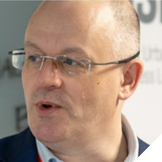

# Zeitgeist: Alumni

CUSP London has alumni who have moved on to other ventures, however, they still remain members and continue to collaborate with us.

<table>
  <tr>
    <td>  Simon Miles   <a href="https://www.linkedin.com/in/simon-miles-20775015/">Ex-Director CUSP London</a></td>
    <td>   Mark Kleinman   <a href="https://www.linkedin.com/in/markkleinman/">Prof. Public Policy</a></td>
     <td>   Nick Holliman   <a href="https://www.linkedin.com/in/markkleinman/(https://www.linkedin.com/in/nick-holliman/)">Prof. Data Visualisation</a></td>
  </tr>
</table>

## More Information

<table border="0" cellspacing="0" cellpadding="0">
  <tr>
    <th>

<a href="https://twitter.com/cusplondon?lang=en">Follow us on Twitter</a>
    </th>
        <th>

<a href="https://www.linkedin.com/company/centre-for-urban-science-and-progress-london-cusp-london-king-s-college-london/)">Follow us on LinkedIn</a>
       </th>
   </tr>
</table>

[Contact us here.](./YouCanJoinUs.md)

