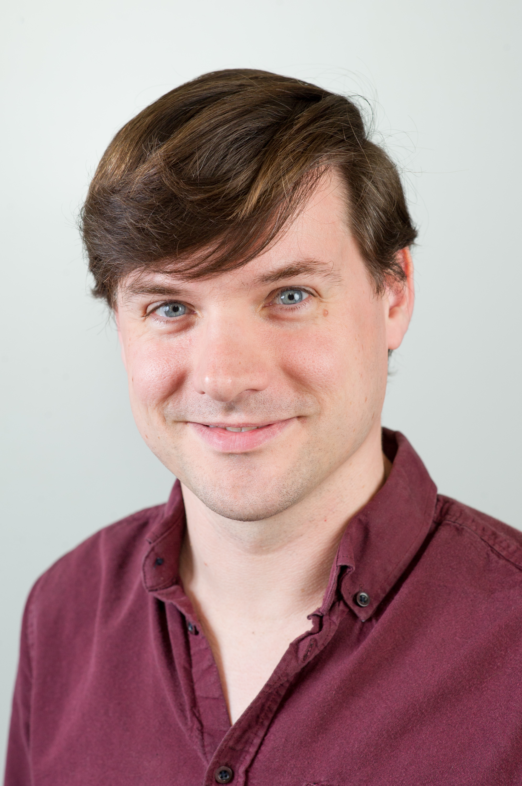

# Zeitgeist: alumni

CUSP London have several alumni who have moved on to other ventures, however they remain members and continue to collaborate with us.
<table>
  <tr>
    <td>  
 Simon Miles   Ex-Director 
 </td>
    <td>  
 Mark Kleinman   CUSP London Academic 
 </td>
  </tr> 
  <tr>
  </tr>
</table>

## CUSP London Academic Partners

| Name | Department |
|-----------------------|------------|
|Alfie Abdul-Rahman|Informatics|
|Rita Borgo|Informatics|
|Elena Simperl|Informatics|
|Daniele Quercia|Informatics|
|Miao Guo|Engineering|
|Yansha Deng|Engineering|
|Zara Shabrina|Geography|
|Angus Roberts|Institute of Psychiatry, Psychology and Neuroscience|
|Alexandru Dregan|Institute of Psychiatry, Psychology and Neuroscience|
|Kalliopi Mylona|Mathematics|

## More Information
[Contact us here.](./YouCanJoinUs.md)

