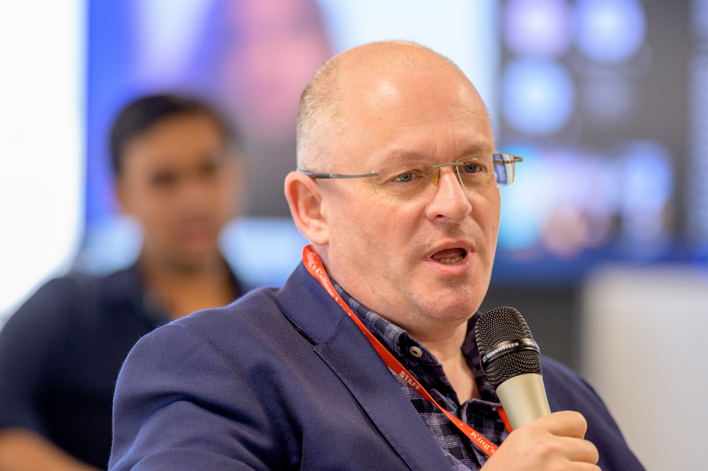

# Director's Message 2022

Joining CUSP London this year has been a chance to listen and learn about its many
achievements as CUSP London develops new directions following the pandemic and the
evolution this brought to urban living. These pages reflect on those achievements and look
forward to how cognitive technologies will impact on our cities in the coming years.
Cognitive technologies, including Data Science, AI, Visualization, AR and VR will help us
understand our cities now, predict where they could go in the future and support our
decision making on the way.

*Nick Holliman, Director CUSP London 2022* 

## More Information

<table border="0" cellspacing="0" cellpadding="0">
  <tr>
    <th>

<a href="https://twitter.com/cusplondon?lang=en">Follow us on Twitter</a>
    </th>
        <th>

<a href="https://www.linkedin.com/company/centre-for-urban-science-and-progress-london-cusp-london-king-s-college-london/)">Follow us on LinkedIn</a>
       </th>
   </tr>
</table>

[Contact us here.](./YouCanJoinUs.md)

