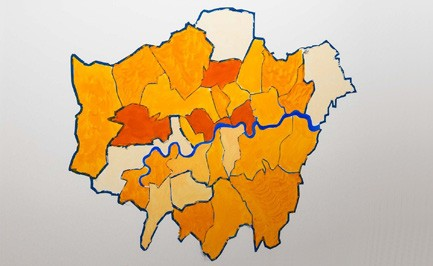
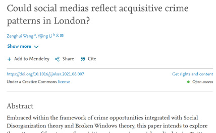
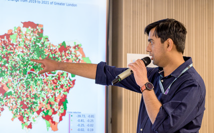
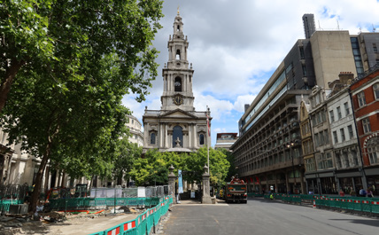

# Transformational Outcomes

<table>
  <tr>
    <td>  </td>
    <td> 
      CUSP London generates many forms of output, both traditional academic work and broader engagements with external partners. 
    </td>
   </tr> 
  
   <tr>
    <td>  </td>
    <td> 
      Academic outputs including journal articles and research grants from EPSRC, The Turing Institute, Research England and others.
    </td>
   </tr> 
  
   <tr>
    <td>  </td>
    <td> 
Skills and knowledge transfer, enhancing the student experience and co-developing new skillsets guided by 29 CUSP London Associates.
    </td>
   </tr> 
  
   <tr>
    <td>  </td>
    <td> 
      Multidisciplinary engagement with twenty external partners, eg the Strand-Aldwych redevelopment project.
    </td>
   </tr> 
  
  
</table>

## More Information

<table border="0" cellspacing="0" cellpadding="0">
  <tr>
    <th>

<a href="https://twitter.com/cusplondon?lang=en">Follow us on Twitter</a>
    </th>
        <th>

<a href="https://www.linkedin.com/company/centre-for-urban-science-and-progress-london-cusp-london-king-s-college-london/)">Follow us on LinkedIn</a>
       </th>
   </tr>
</table>

[Contact us here.](./YouCanJoinUs.md)

