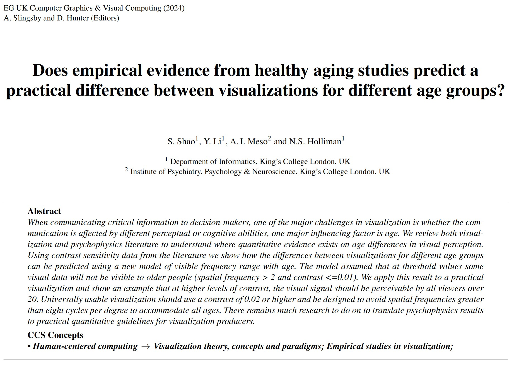

# Transformational Outcomes

<table>
  <tr>
    <td>  </td>
    <td> 
      CUSP London produces many forms of output, including traditional academic work and software (such as Vizent), influencing groups across the city and the world.
    </td>
   </tr> 
  
   <tr>
    <td>  </td>
    <td> 
      Academic outputs including articles with research funding from EPSRC, The Alan Turing Institute, UKRI, KCL and industry funders.
    </td>
   </tr> 
  
   <tr>
    <td>  </td>
    <td> 
Skills and knowledge transfer for our partners.  Including the Data Dive, on-site one-day courses, free online training courses and consultancy.
    </td>
   </tr> 
  
   <tr>
    <td>  </td>
    <td> 
      Multidisciplinary engagement with eternal partners, eg via the KHP EPSRC Digital Health Hub at King's.
    </td>
   </tr> 
  
  
</table>

## More Information

<table border="0" cellspacing="0" cellpadding="0">
  <tr>
    <th>

<a href="https://twitter.com/cusplondon?lang=en">Follow us on Twitter</a>
    </th>
        <th>

<a href="https://www.linkedin.com/company/centre-for-urban-science-and-progress-london-cusp-london-king-s-college-london/)">Follow us on LinkedIn</a>
       </th>
   </tr>
</table>

[Contact us here.](./YouCanJoinUs.md)

