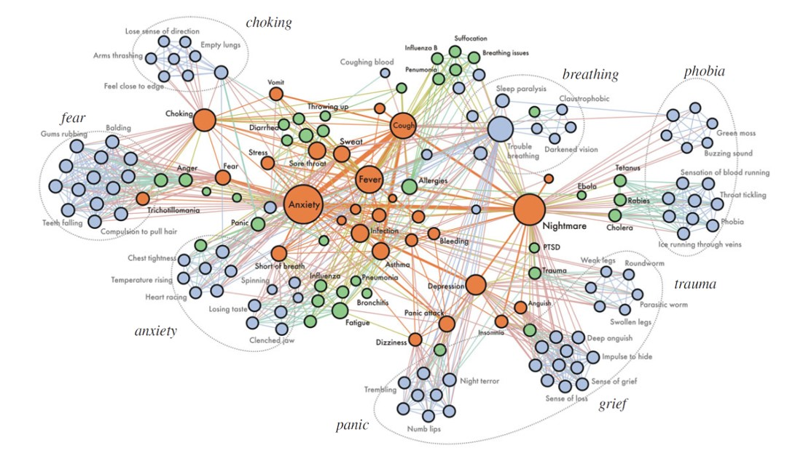

# Partnerships and Engagement

Engagement with external partners is central to CUSP London activities, this provides real world context for research projects, supports placements, leads to employment opportunities and delivers value to our partners including access to the latest digital skills.
 

> "As Nokia, we cherish our partnership with CUSP, where cutting-edge technology meets brilliant minds, fostering co-creation, innovation, and a cuture of transformative ideas.  Together, we shape the future of connectivity, revolutionizing how people experience and interact with technology in the cities of tomorrow"

*Dr Daniele Quercia, Nokia Bell Labs*
 

> "The MSc Urban Informatics at CUSP London has helped me launch my career in the UK. The course covered advanced Data Science tools and techniques but just as quickly provided real opportunities to use them, working with real-world data in Projects and research... 
A CUSP placement at global consulting firm WSP provided me the connections which gave me my first full-time work in London"

*Raphael Canty, 2020–21 alumnus, first employed by WSP in London and now with TfL*
 
 

CUSP London hosts an Autumn PhD Conference with both internal King's participants and participants from collaborators across the UK. We welcome any doctoral students interested in presenting to contact us at: CUSP-London@kcl.ac.uk

## More Information

<table border="0" cellspacing="0" cellpadding="0">
  <tr>
    <th>

<a href="https://twitter.com/cusplondon?lang=en">Follow us on Twitter</a>
    </th>
        <th>

<a href="https://www.linkedin.com/company/centre-for-urban-science-and-progress-london-cusp-london-king-s-college-london/)">Follow us on LinkedIn</a>
       </th>
   </tr>
</table>

[Contact us here.](./YouCanJoinUs.md)

