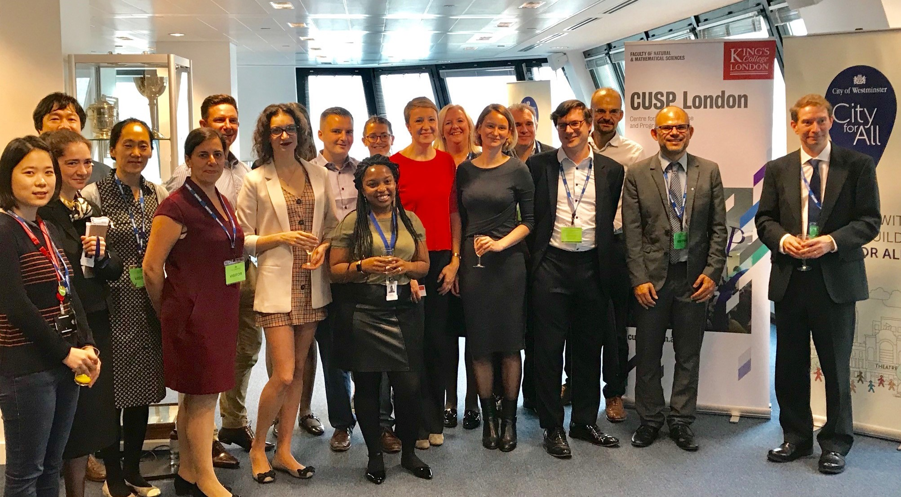

# Partnerships and Engagement

*Group photo taken in 2018 at the official signing of the Statement of Intent between CUSP London and Westminster City Council.* 

Engagement with external partners is central to CUSP London activities, this provides real world context for research projects, supports placements, leads to employment opportunities and delivers value to our partners including access to the latest digital skills.
 

> "One of the big wins from working with CUSP London, was that we got the Data Strategy arranged and open data is now in our City for All Strategy, which is a big culture change for us, really important."

*Dr Sophie Johnson, Deputy Chief Analyst, Westminster City Council*
 

> "The MSc Urban Informatics at CUSP London has helped me launch my career in the UK. The course covered advanced Data Science tools and techniques but just as quickly provided real opportunities to use them, working with real-world data in Projects and research... 
A CUSP placement at global consulting firm WSP provided me the connections which gave me my first full-time work in London"

*Raphael Canty, 2020–21 alumnus, now employed at WSP in London*
 

## More Information

<table border="0" cellspacing="0" cellpadding="0">
  <tr>
    <th>

<a href="https://twitter.com/cusplondon?lang=en">Follow us on Twitter</a>
    </th>
        <th>

<a href="https://www.linkedin.com/company/centre-for-urban-science-and-progress-london-cusp-london-king-s-college-london/)">Follow us on LinkedIn</a>
       </th>
   </tr>
</table>

[Contact us here.](./YouCanJoinUs.md)

