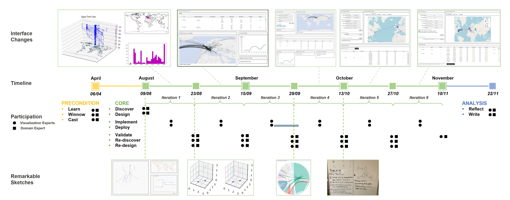
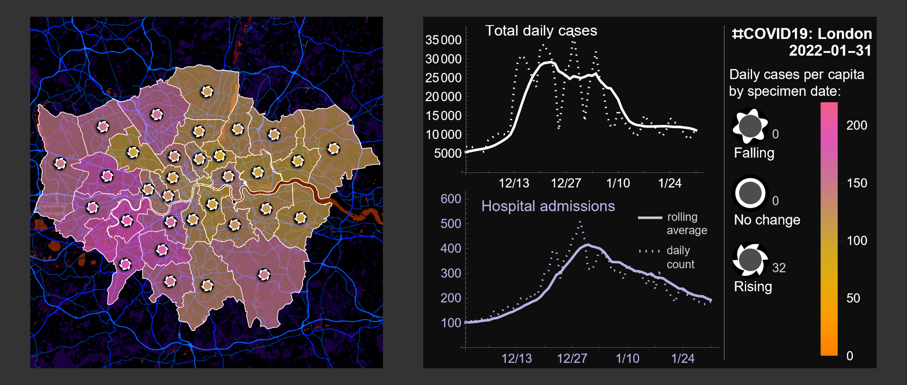
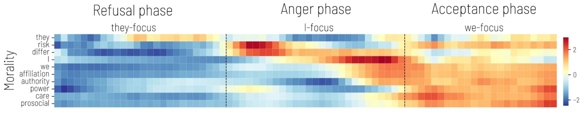

# Interdisciplinary Research

Ensuring the clarity of visual communications for decision-makers and the public is a core part of CUSP London’s mission.

Above: How can we visualize complex data relating to transport congestion in London so that it is easy to act on in a control room?

Below: A comparison of how different groups of people interpret different types of visualization, finding artists have good statistical skills.

**2023 research:**  
How do we know visual representations are understood universally? 

We are investigating the use of 3D Digital Twins to engage and inform everyone about their urban environment and how it changes.
 
 

How do we know the origins and accuracy of information? 

A visual book tracker following changes over space and time in historic books.  The provenance of information and guarantees of its quality are increasingly hard to track with the rise of AI text generation.
 
 

**2022 research:**  

Inherently multidisciplinary research has led CUSP London to become involved in a diverse range of projects during the last few years. 
Not surprisingly a number of these projects related to COVID-19 and its impact around the world, as academics from all disciplines worked to contribute to understanding and resisting  the pandemic.

Looking to the future there is a pressing need for cognitive technologies that work with people to help find ways to address the most difficult challenges we have faced in many people’s lifetimes. 

*COVID 19 in London in 2022, an example of bivariate glyphs representing both case rates and whether cases are increasing or decreasing* 

*Evolution of responses to the COVID-19 pandemic in the U.S. tracked via Twitter three phases were observed, refusal, anger, acceptance. Aiello, Quercia et al, H&SMC (8), 2021.*

## More Information

<table border="0" cellspacing="0" cellpadding="0">
  <tr>
    <th>

<a href="https://twitter.com/cusplondon?lang=en">Follow us on Twitter</a>
    </th>
        <th>

<a href="https://www.linkedin.com/company/centre-for-urban-science-and-progress-london-cusp-london-king-s-college-london/)">Follow us on LinkedIn</a>
       </th>
   </tr>
</table>

[Contact us here.](./YouCanJoinUs.md)

