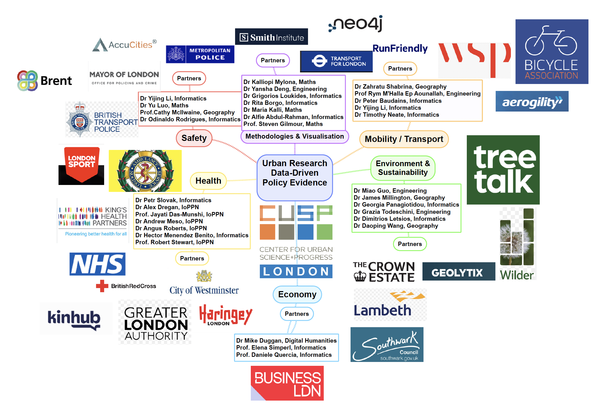
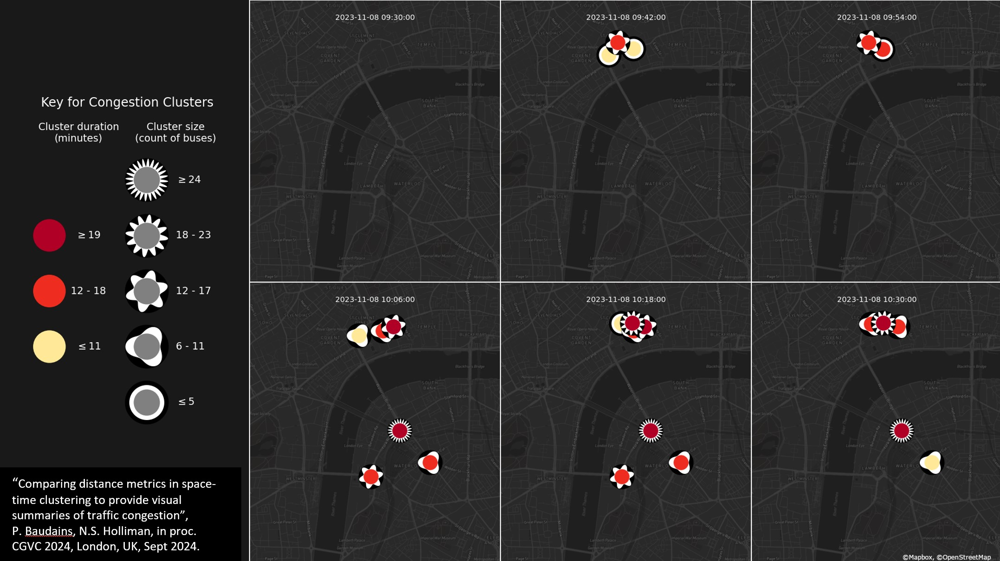
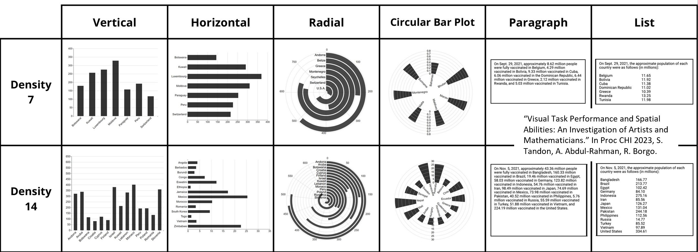

# Interdisciplinary Research & Impact

CUSP London thrives on its vibrant interdisciplinary research community, bringing together diverse skills and expertise, and is strongly supported by our committed partners!

Here are the details of our diverse external partnerships and collaborators, as represented on the CUSP London Research-Partnership Tree Map.

 
 

 
 
<b>CUSP London Impact Stories:</b> 
<b>Pioneering Data Driven Humanitarian Aid - Student Placement with The British Red Cross.</B> 
<b>Overview:</b> 
Ruonan Zhang, an MSc student from King’s College London, interned with the Strategic Insight & Foresight team at the British Red Cross (BRC). Under Michael Page’s guidance, she contributed to the development of the Resilience Index, a tool to identify UK local authorities vulnerable in crises. 
Key Contributions: 
Data Integration and Workflow Design: 
Utilised skills from the MSc Urban Informatics programme to source, process, and integrate data from diverse repositories across four nations. 
Employed R programming to structure and simplify data for actionable insights. 
Designed a user-friendly and comprehensive workflow for the Resilience Index. 
Enhancing Resilience Planning: 
Developed a tool combining multiple indicators to pinpoint vulnerable regions. 
Ensured data-driven decisions were complemented by community engagement to align aid with real needs. 
<b>Impact:</b> 
Improved the BRC’s resource allocation and preparedness strategies. 
Enabled timely, targeted humanitarian interventions with optimized response times. 
Personal and Professional Growth: 
Gained practical experience in large-scale project management and real-world application of data science. 
Enhanced technical skills, including coding and data analysis, while refining her understanding of humanitarian operations.
Left a lasting impact on the BRC’s resilience strategy and fortified her readiness for future roles, including her current position as a Data Scientist at Lynchpin. 
<b>Legacy:</b> 
Ruonan’s work demonstrates how academic training can drive meaningful humanitarian outcomes, exemplifying KCL’s ethos of transforming knowledge into action. 
 
 
<b>Unlocking The Power of Urban Informatics to Improve Information Visualisations in Haringey, London.</b> 
<b>Overview:</b>
Songchen Yao, an MSc Urban Informatics student, completed a 10-week placement at the London Borough of Haringey.  Supervised by Dr. Yijing Li (KCL) and Mr. Edurado Lopez Salas (Haringey Council), he worked on unveiling key sociodemographic data for the borough. 

Key Contributions: 
Interactive Web Page for Data Visualisation: 
Designed an interactive web page showcasing Haringey's sociodemographic data using advanced visualisation techniques.
Made data accessible and engaging for the council and citizens, leveraging skills from KCL courses like “Telling the Story of Data.” 
Promoting Data Openness and Engagement: 
Addressed the need for clear communication of government data to a diverse population of over 260,000 residents. 
Transformed raw statistics into visually appealing and user-friendly narratives, fostering greater public understanding.
Empowering Community Participation: 

<b>Impact:</B> 
Songchen’s work lays the foundation for a more informed, engaged, and environmentally aware community in Haringey. His placement showcases the real-world impact of urban informatics, empowering both his professional aspirations and the borough’s development efforts. 
He gained practical experience in data visualisation, problem-solving, and working in a dynamic local government setting.
Overcame challenges such as data discrepancies, strengthening his resilience and adaptability.
<b>Legacy:</B> 
This project breaks down barriers and encourages public engagement. Local residents, community leaders, and visitors alike find themselves empowered with easy access to vital data, bridging the gap between the Haringey council and its citizens. 
<b>Legacy: </B> 
Through his data visualizations and cartograms, Songchen effectively communicates complex environmental issues, sparking a collective understanding of the borough's realities, such as demonstrating the local carbon emissions.  
The web page becomes a catalyst for dialogue, encouraging open discussions and empowering the community to actively participate in decision-making processes. As environmental awareness flourishes, local residents and stakeholders collaborate with renewed vigour, coming together to address pressing issues and co-create sustainable solutions. The work hence not only strengthens community bonds but also lays the foundation for a more informed and engaged society, where individuals feel a sense of ownership and responsibility for their environment. 

**2024 research:**  

Ensuring the clarity of visual communications for decision-makers and the public is a core part of CUSP London’s mission.
 
 

 
 
Above: How can we visualize complex data relating to transport congestion in London so that it is easy to act on in a control room?

Below: A comparison of how different groups of people interpret different types of visualization, finding artists have good statistical skills.
 
 

 
 

**2023 research:**  

How do we know visual representations are understood universally? 

We are investigating the use of 3D Digital Twins to engage and inform everyone about their urban environment and how it changes.
 
 

How do we know the origins and accuracy of information? 

A visual book tracker following changes over space and time in historic books.  The provenance of information and guarantees of its quality are increasingly hard to track with the rise of AI text generation.
 
 

**2022 research:**  

Inherently multidisciplinary research has led CUSP London to become involved in a diverse range of projects during the last few years. 
Not surprisingly a number of these projects related to COVID-19 and its impact around the world, as academics from all disciplines worked to contribute to understanding and resisting  the pandemic.

Looking to the future there is a pressing need for cognitive technologies that work with people to help find ways to address the most difficult challenges we have faced in many people’s lifetimes. 

*COVID 19 in London in 2022, an example of bivariate glyphs representing both case rates and whether cases are increasing or decreasing* 

*Evolution of responses to the COVID-19 pandemic in the U.S. tracked via Twitter three phases were observed, refusal, anger, acceptance. Aiello, Quercia et al, H&SMC (8), 2021.*

## More Information

<table border="0" cellspacing="0" cellpadding="0">
  <tr>
    <th>

<a href="https://twitter.com/cusplondon?lang=en">Follow us on Twitter</a>
    </th>
        <th>

<a href="https://www.linkedin.com/company/centre-for-urban-science-and-progress-london-cusp-london-king-s-college-london/)">Follow us on LinkedIn</a>
       </th>
   </tr>
</table>

[Contact us here.](./YouCanJoinUs.md)

