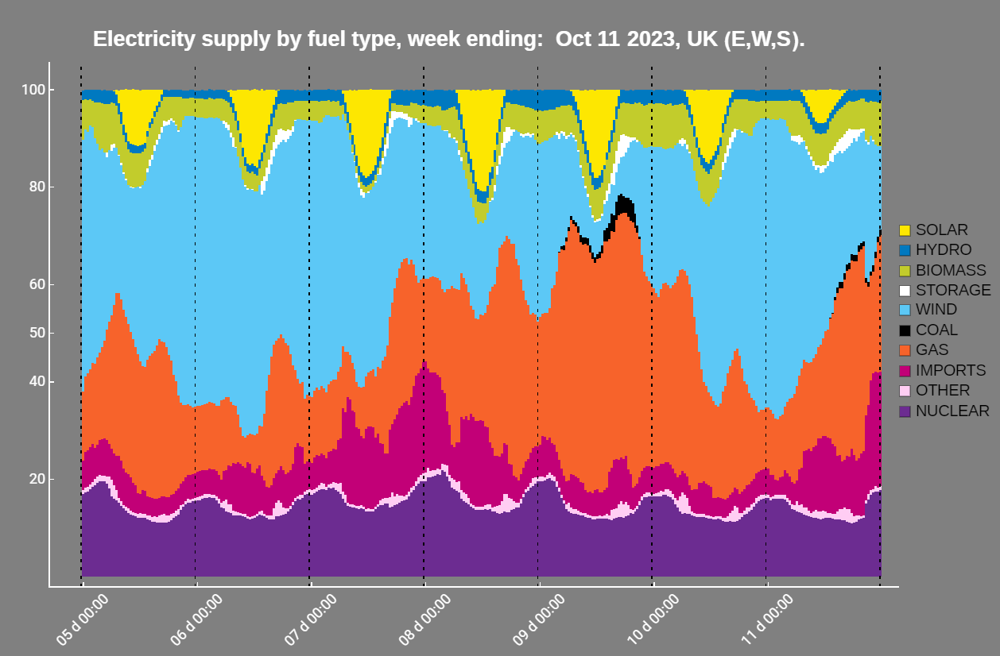

# Skills and Knowledge

CUSP London founded the King’s MSc in Urban Informatics which attracts students internationally who work on projects with external partners including consulting companies, local government and the emergency services. Moving forward we are opening these opportunities to students across all Informatics programmes.
A highlight of the CUSP London year is the annual Data Dive, a week long event bringing together Trans-Atlantic students and mentors to experience working in teams on real-world data challenges. The 2023 challenges included Mental Health data and its relation to urban factors.

Team members joined live and virtually from the UK, New York, Perth in Australia and Singapore, with challenge questions set by staff from the King's Institute of Psychiatry, Psychology and Neuroscience.

*Loved the event, met a lot of students from other universities and learnt a lot. Data Dive 2022* 
 
 
Among the wide range of tools used during the year at CUSP London is the Wolfram Research Mathematica software, using this we produce weekly updates on the UK electricity fuel use statistics from our partners at National Grid ESO. These provide easy insights into the different soures of electrical power in the UK, including the routine use of Gas as a balancing fuel whenever the Wind reduces.

)

 
 

## More Information

<table border="0" cellspacing="0" cellpadding="0">
  <tr>
    <th>

<a href="https://twitter.com/cusplondon?lang=en">Follow us on Twitter</a>
    </th>
        <th>

<a href="https://www.linkedin.com/company/centre-for-urban-science-and-progress-london-cusp-london-king-s-college-london/)">Follow us on LinkedIn</a>
       </th>
   </tr>
</table>

[Contact us here.](./YouCanJoinUs.md)

