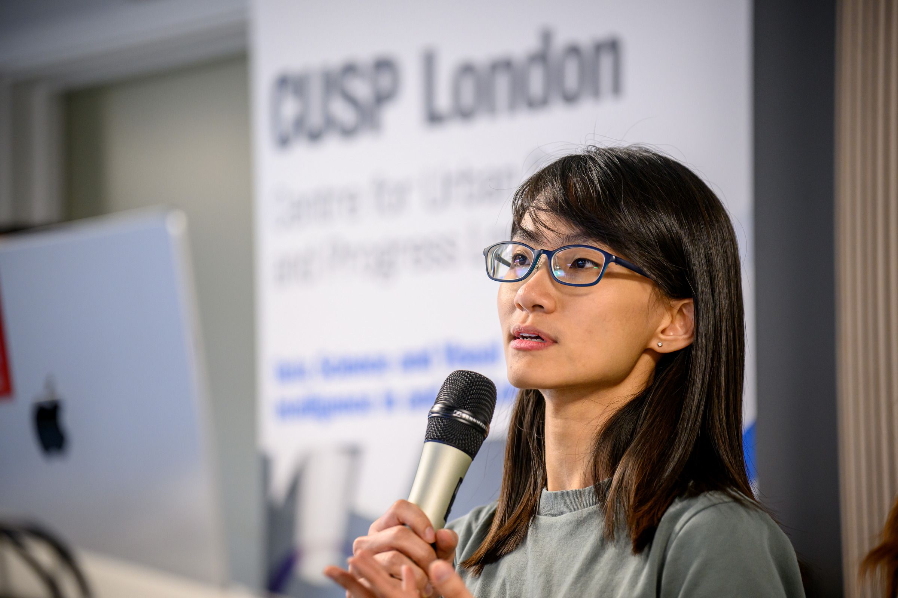

# Skills and Knowledge

CUSP London founded the King’s MSc in Urban Informatics which attracts students internationally. They work on projects with external partners including consultancy companies, local government and the emergency services.

A highlight of the CUSP London year is the annual Data Dive, a week-long event bringing together trans-global students and mentors. This year again from three continents, to experience working in teams on real-world data challenges. 

The 2024 challenge investigated Urban traffic and air quality data and its relation to safety and health. Team members joined live and virtually from the UK, NYU New York and NYU Abu Dhabi. The challenge questions were set by staff from Imperial College and Transport for London

*"Loved the event, met a lot of students from other universities and learnt a lot."* Data Dive 2022 
 
 

## More Information

<table border="0" cellspacing="0" cellpadding="0">
  <tr>
    <th>

<a href="https://twitter.com/cusplondon?lang=en">Follow us on Twitter</a>
    </th>
        <th>

<a href="https://www.linkedin.com/company/centre-for-urban-science-and-progress-london-cusp-london-king-s-college-london/)">Follow us on LinkedIn</a>
       </th>
   </tr>
</table>

[Contact us here.](./YouCanJoinUs.md)

