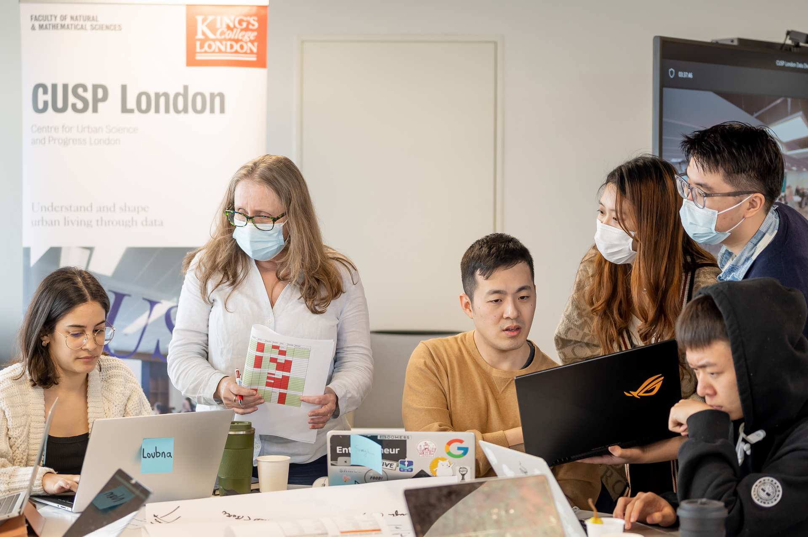

# Skills and Knowledge

CUSP London founded the King’s MSc in Urban Informatics which attracts students internationally who work on projects with external partners including consulting companies, local government and the emergency services. Moving forward we are opening these opportunities to students across all Informatics programmes.
A highlight of the CUSP London year is the annual Data Dive, a week long event bringing together Trans-Atlantic students and mentors to experience working in teams on real-world data challenges. The 2022 challenges included emergency planning, stop and search and Covid-19.

*Loved the event, met a lot of students from other universities and learnt a lot. Data Dive 2022* 

## More Information

<table border="0" cellspacing="0" cellpadding="0">
  <tr>
    <th>

<a href="https://twitter.com/cusplondon?lang=en">Follow us on Twitter</a>
    </th>
        <th>

<a href="https://www.linkedin.com/company/centre-for-urban-science-and-progress-london-cusp-london-king-s-college-london/)">Follow us on LinkedIn</a>
       </th>
   </tr>
</table>

[Contact us here.](./YouCanJoinUs.md)

