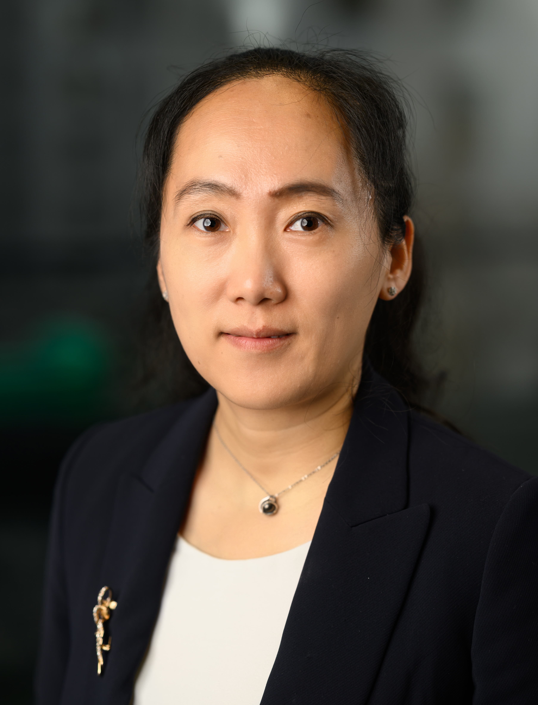
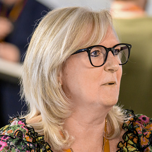

# Who We Are

CUSP London brings together a multi-disciplinary teams of academics, a group of associates from external partners and students working  with CUSP.

<table>
  <tr>
    <td>  
 Yijing Li   Interim Director 
 </td>
    <td>  
 Claire Crowther   Centre Manager 
 </td>
  </tr> 
  <tr>
    <td> </td>
    <td>  
 Peter Baudains   Research Software Engineer 
 </td>
  </tr>
</table>

## CUSP London Academic Partners

| Name | Department |
|-----------------------|------------|
|Alfie Abdul-Rahman|Informatics|
|Rita Borgo|Informatics|
|Georgia Panagiotidou|Informatics|
|Daniele Quercia|Informatics|
|Tim Neate|Informatics|
|Hector Menendez Benito|Informatics|
|Grazia Todeschini|Engineering|
|Rym M'Hallah|Engineering|
|Miao Guo|Engineering|
|Yansha Deng|Engineering|
|Wei he|Engineering|
|Zara Shabrina|Geography|
|Angus Roberts|Institute of Psychiatry, Psychology and Neuroscience|
|Andrew Meso|Institute of Psychiatry, Psychology and Neuroscience|
|Yu Luo|Mathematics|
|Maria Kalli|Mathematics|
|Simon Miles - Founding Director|Alumni|
|Nick Holliman - Director (2022-24) |Alumni|
|Mark Kleinman|Alumni|

## More Information
 
<table border="0" cellspacing="0" cellpadding="0">
  <tr>
    <th>

<a href="https://twitter.com/cusplondon?lang=en">Follow us on Twitter</a>
    </th>
        <th>

<a href="https://www.linkedin.com/company/centre-for-urban-science-and-progress-london-cusp-london-king-s-college-london/)">Follow us on LinkedIn</a>
       </th>
   </tr>
</table>

[Contact us here.](./YouCanJoinUs.md)

